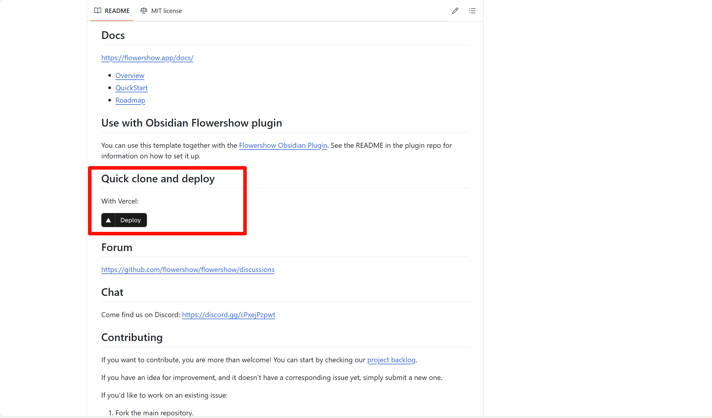
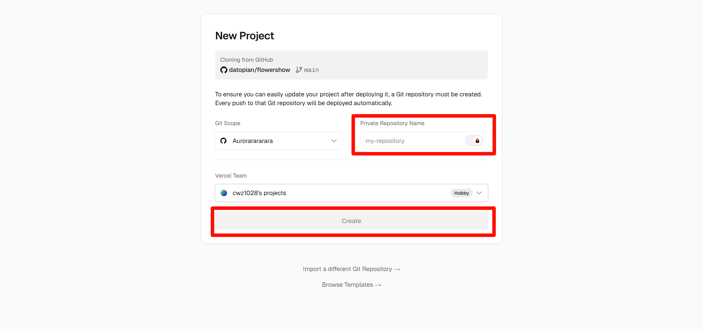
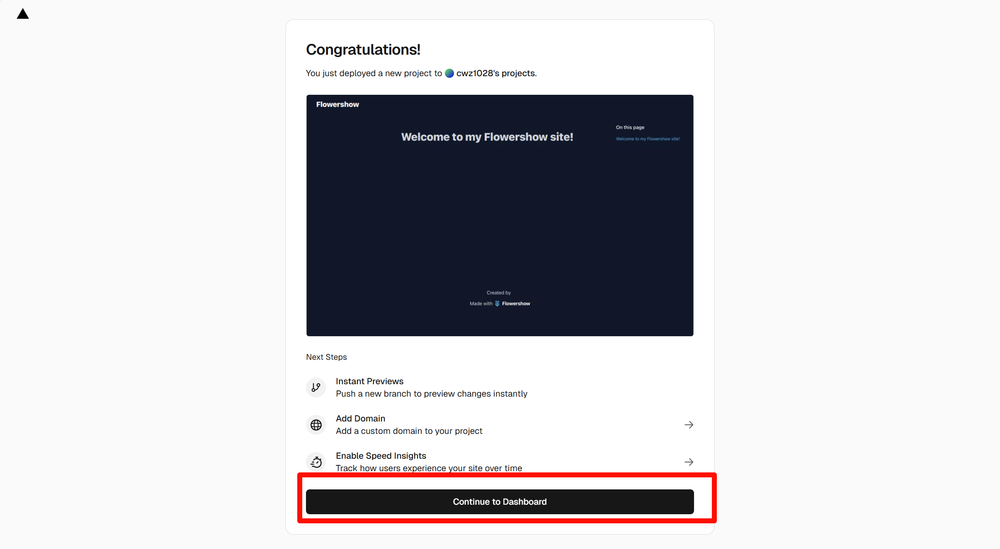

文章参考：[使用 Obsidian 免费建个人博客 | PrintLove](https://www.printlove.cn/obsidian-blog/)

## Flowershow方案
网址：[Flowershow](https://flowershow.app/)

1. 进入Github网址：[datopian/flowershow: 💐 Publish your obsidian digital garden or any markdown site easily and elegantly.](https://github.com/datopian/flowershow)
2. 点击Deploy

3. 创建文件

4. 等文件部署完后，点击继续按钮

5. 配置域名

