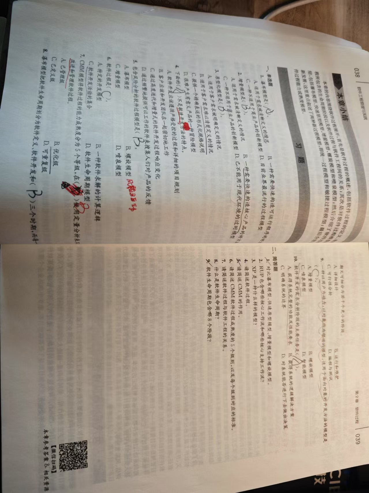
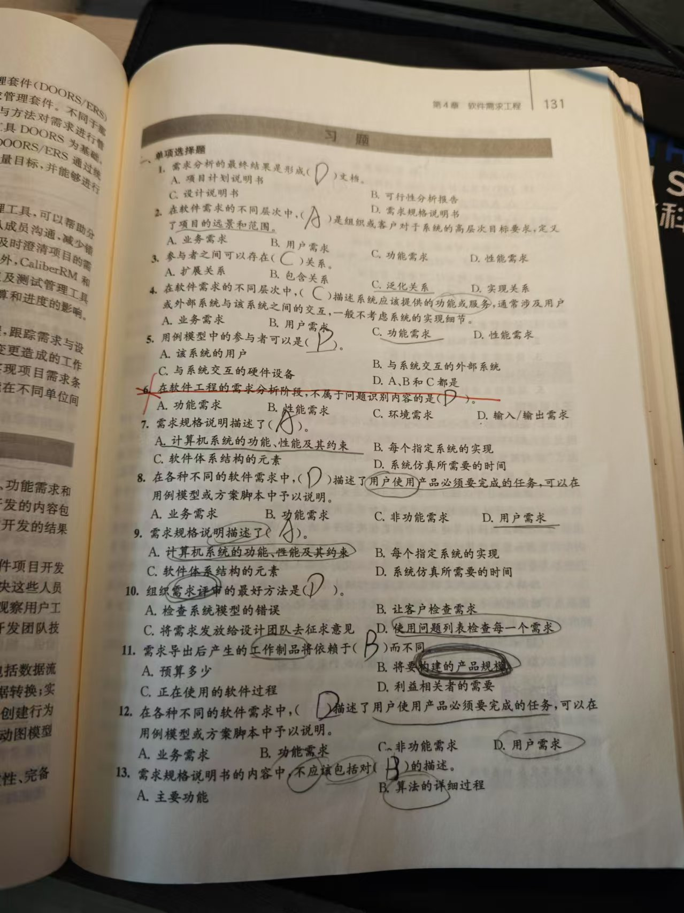
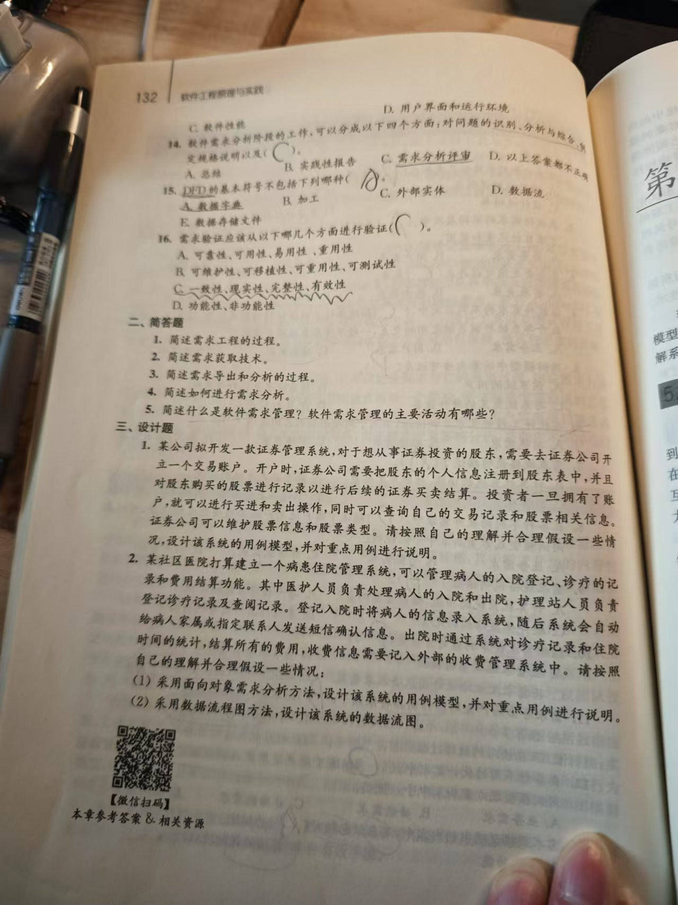
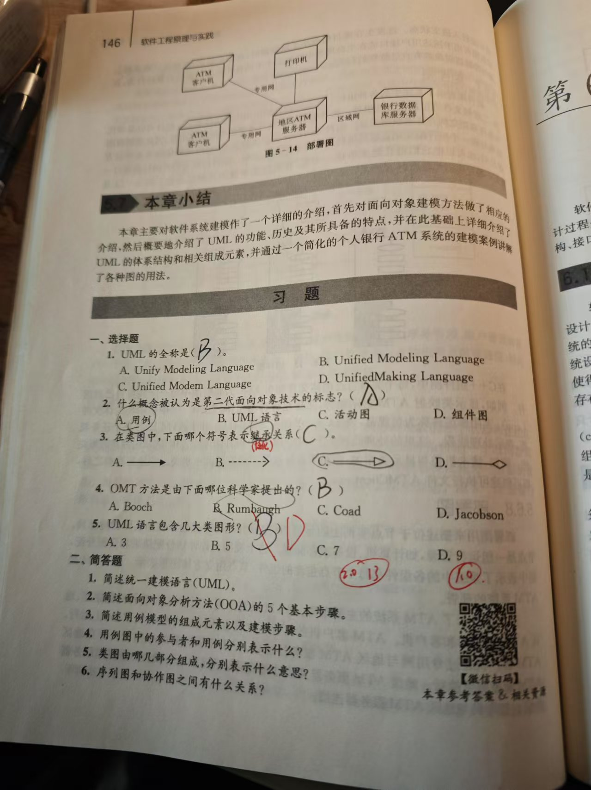
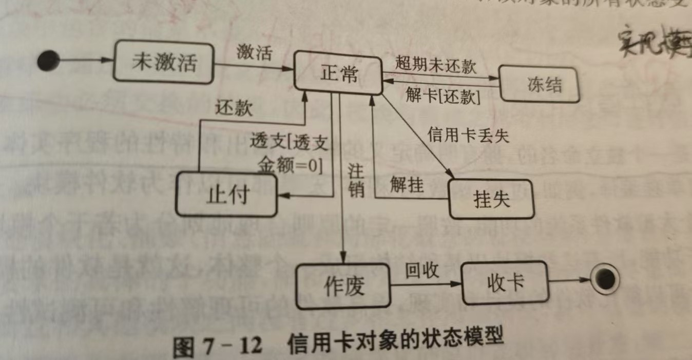
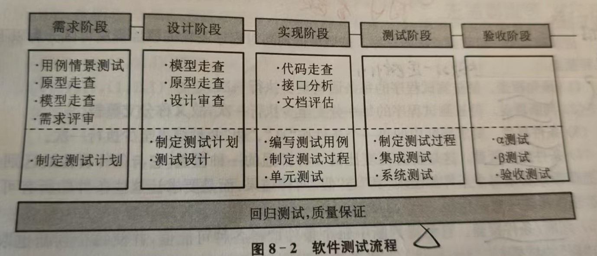

# 软件的概念：程序、数据、文档。（缺一不可）
===软件是指与计算机系统操作有关的程序、数据以及配套的文档资料。===

软件由两部分组成：一是机器可执行的程序和数据，程序是按事先设计的功能和性能要求执行的指令序 列，数据是程序运行时输入和输出的内容；二是与软件开发、维护和使用有关的文档资料

# P5软件危机：什么是软件危机、软件危机的表现、软件危机产生的原因、怎么解决软件危机。
软件危机是指在计算机软件的开发和维护过程中所遇到的一系列严重问题。
**表现：**
1.  开发进度难以预测，开发成本难以控制
2.  开发的软件不能满足用户需求
3.  软件产品质量无法保证
4.  软件产品难以维护
5.  软件缺少适当的文档资料

产生的原因：
1.  用户需求不明确
2.  缺乏正确的理论指导
3.  软件开发规模越来越大
4.  软件开发复杂度越来越高

**解决软件危机：**
他们提出了“软件工程”的概念，从组织管理措施和技术措施两方面研究如何更好的开发和维护计算机软件，从而减轻软件危机所带来的影响

# P7软件工程：软件工程的定义、软件工程产生的背景以及软件工程是什么时候提出来的。
定义：应用计算机科学理论和技术以及工程原理和方法，按预算和进度，**实现满足用户要求的软件产品的定义、开发、发布和维护的工程或进行研究的学科**
**背景**：为消除软件危机
**提出时间**：20世纪60年代末 1968年

# P11软件工程职业道德规范（了解，不考大题）
原则1：公众软件工程师应当以公众利益为目标
原则2：客户和雇主再保持与公众利益一致的原则下，软件工程师应注意满足客户和雇主的最高利益
原则3：产品软件工程师应当确保他们的产品和相关的改进符合最高的专业标准
原则4：软件工程师应当维护他们职业判断的完整性和独立性
原则5：管理软件工程的经理和领导人员应赞成和促进对软件开发和维护合乎道德规范的管理
原则6：专业再与公众利益一致的原则下，软件工程师应当推进其专业的完整性和荣誉
原则7：同行软件工程师对其同行应持平等和互助和支持的态度
原则8：自身软件工程师应当参与终生职业实践的学习，并促进合乎道德的职业实践方法

# P17课后习题

1. **什么是软件工程？它的目标和内容是什么？**
    - 软件工程是一门研究用工程化方法构建和维护有效的、实用的和高质量的软件的学科。它涉及程序设计语言、数据库、软件开发工具、系统平台、标准、设计模式等方面。
    - 目标：
        - 生产具有正确性、可用性以及开销合宜的产品。
        - 软件能够按时交付，并在预算内完成。
        - 软件具有可维护性、可扩展性和可重用性。
    - 内容：
        - 软件开发模型（如瀑布模型、敏捷开发模型等）。
        - 软件需求分析与规格说明。
        - 软件设计（包括架构设计、详细设计）。
        - 软件编码与实现。
        - 软件测试（单元测试、集成测试、系统测试等）。
        - 软件维护与演化。
2. **与计算机硬件相比，计算机软件有哪些特点？**
    - 抽象性：软件是逻辑实体，不是物理实体，具有高度的抽象性。
    - 复杂性：软件系统可能包含大量的逻辑关系和交互，比硬件更复杂。
    - 易变性：软件可以很容易地修改和更新，而硬件修改通常需要更换物理部件。
    - 不可见性：软件没有物理形态，无法直接观察其内部结构和运行状态。
    - 成本主要在开发阶段：硬件成本主要在生产阶段，而软件开发成本主要在设计和编码阶段。
3. **什么是软件危机？导致软件危机的原因有哪些？**
    - 软件危机是指在计算机软件的开发和维护过程中所遇到的一系列严重问题，如项目超支、进度延迟、软件质量低下等。
    - 导致软件危机的原因：
        - 软件规模和复杂性不断增加，超出了传统开发方法的能力。
        - 缺乏有效的项目管理方法，导致项目失控。
        - 软件需求不明确或频繁变更，导致开发过程反复。
        - 软件开发过程缺乏规范和标准，导致质量难以保证。
        - 软件开发人员缺乏足够的培训和经验。
4. **请简述软件工程的三要素。**
    - 方法：指软件开发过程中使用的各种技术和方法，如结构化方法、面向对象方法等。
    - 工具：指软件开发过程中使用的各种辅助工具，如集成开发环境（IDE）、版本控制工具、测试工具等。
    - 过程：指软件开发的一系列步骤和活动，包括需求分析、设计、编码、测试、维护等，通常按照某种软件开发模型（如瀑布模型、敏捷模型）来组织。
5. **请简述软件工程的研究内容。**
    - 软件工程的研究内容包括：
        - 软件开发模型和方法：研究如何高效地开发软件，如敏捷开发、迭代开发等。
        - 软件需求工程：研究如何准确地获取、分析和管理软件需求。
        - 软件设计：研究如何设计软件的架构和详细结构，包括数据库设计、界面设计等。
        - 软件编码：研究如何编写高质量的代码，包括编程语言的选择和使用。
        - 软件测试：研究如何有效地测试软件，包括测试策略、测试用例设计等。
        - 软件维护：研究如何在软件交付后进行维护和演化，包括错误修复、功能增强等。
        - 软件项目管理：研究如何管理软件开发项目，包括进度管理、成本管理、质量管理等。

# P19软件过程与软件生命周期（三个时期八个阶段、知道每个阶段要做什么）
三个时期：软件定义时期，软件开发时期，软件维护时期八个阶段
1.  问题定义：要解决的问题是什么？
2.  可行性研究：探索这个问题是否值得去解决，是否有可行的解决方案。
3.  需求分析：系统做什么？
4.  概要设计：如何实现系统？
5.  详细设计：应该怎样具体地实现这个问题？
6.  编程：编写代码
7.  软件测试：白盒测试和黑盒测试
8.  软件维护：维护

# P22软件过程模型（五个模型以及每个模型的特点）
## 瀑布模型
特点
- 一种文档驱动的线性顺序开发模型。
- 开发过程分为需求分析、设计、编码、测试和维护等阶段，按顺序逐步完成。强调每个阶段的文档产出，适合需求明确且变化较少的项目。

适用场景
- **功能和性能明确**、完整、且无重大变化的软件系统。需要严格控制进度和质量的大型项目。

优点
- 清晰的阶段划分和文档记录。易于管理，适合初学者使用。

缺点
- 不适合需求不明确或易变的项目。难以进行中途修改，缺乏灵活性。

**举例**：开发一款功能固定的财务报表软件，需求明确，如每月固定格式的财务报表生成、数据统计等功能，就适合瀑布模型

## 快速原型模型
特点
- 通过快速构建软件的原型模型，帮助用户明确需求。
- 原型通常实现关键功能，但不注重完整性或性能，最终被逐步替代或废弃。强调用户参与和反馈，以便对需求进行反复迭代。
  
适用场景
- **用户需求不明确**或经常变化的软件系统。需要用户高度参与和快速验证的项目。

优点
- 提高需求的准确性，减少误解。便于快速验证和调整设计思路。

缺点
- 可能导致开发周期延长。
- 如果管理不善，容易形成原型替代正式系统的风险。

**举例**：开发一款虚拟现实（VR）游戏，用户很难一开始就明确操作方式、场景等需求，通过构建简单的原型让用户体验，然后根据反馈修改，适合此模型。

## 增量模型
特点
- 将整个系统分解为多个可独立交付的增量，每个增量在独立开发后逐步交付。每个增量都包含需求分析、设计、编码和测试等完整过程。
- 系统最终通过多个增量逐步完善。

适用场景
- 需求较为明确，但部分功能可以逐步实现的软件系统。开发周期要求较短，需早期交付部分功能的项目。**在明确部分核心需求后，将平台功能分解为多个增量**

优点
- 灵活性高，可根据用户反馈调整开发计划。
- 降低开发风险，优先实现核心功能。

缺点
- 整体架构需要事先规划好，整合工作可能较复杂。
- 对开发团队的协作要求较高。

**举例**：开发一个大型电商平台，可先开发商品展示和购买功能作为一个增量交付，然后再开发物流查询、用户评价等增量。

## 螺旋模型
特点
- 是一种基于风险分析的迭代式开发模型。
- 每个开发周期包含规划、风险分析、开发与测试、用户评价四个步骤。
- 通过反复迭代，每次逐步完善系统，直至完成。

适用场景
- 复杂、规模大、技术风险高的项目。
- 需求可能不断变化的软件系统。

优点
- 强调风险分析，适合高风险项目。
- 可灵活应对需求变化。

缺点
- 对开发团队的风险管理能力要求较高。
- 开发成本和周期可能较高。

**举例**：开发一个核电站控制系统软件，技术复杂、风险高，需要在每个迭代周期考虑安全风险、技术可行性等因素，适合螺旋模型。

## 喷泉模型
特点
- 一种面向对象的软件过程模型。
- 强调活动的重叠性和迭代性，开发过程中各阶段之间不是线性的，而是相互交替和融合的。 强调组件的复用性和模块化开发。

适用场景
- 面向对象开发方法的软件系统。
- 需要高效模块化和复用性的软件项目。

优点
- 支持高复用性，节约开发时间和成本。
- 强调活动的灵活性和并行性，适应现代开发环境。

缺点
- 对团队的面向对象技术能力要求较高。
- 需要良好的架构设计以实现高复用性。

**举例**：开发一个企业级 Java 办公自动化系统，利用面向对象特性构建用户、文档、流程等模块，模块之间相互关联且可复用，适合喷泉模型。
# P38课后习题

# P95软件需求工程：引言第一段（需求分析阶段做什么）
软件需求工程其基本任务是准确地回答“软件系统必须做什么？”这个问题
软件需求定义
1.  用户为解决某一个问题或为达到某个目标所需要地条件或能力
2.  系统或系统部件为满足合同、标准、规格说明或其他正式地强制性文档所必须具有的条件和能力
3.  对上述两点所描述的条件或能力的文档化说明

# P103需求建模：面向对象的需求建模和结构化的需求建模（面向对象的用例建模（大题）用例模型的三 个组成元素。（参与者之间是泛化关系、跟用例之间是关联关系。用例和用例之间的关系：包含关系、 扩展关系、泛化关系））
大题

# P111活动图建模（面向对象开发的第二种建模）（了解活动图的概念，不考大题）
活动图是一种用于描述系统行为的模型视图，活动图可记录单个操作或方法的逻辑、单个用例或商业过 程的逻辑流程，其实质是一种流程图

活动图的组成：
1.  动作状态（活动）
2.  活动状态
3.  动作流
4.  分支和合并
5.  分叉与汇合
6.  泳道

# P118面向数据流的建模法（结构化开发方法的需求分析阶段）：数据流图和数据字典。数据流图（大 题）
DFD大题

1. **定义**
    - 数据字典是在软件开发、数据库设计以及系统分析等领域广泛使用的一种工具。它是对系统中使用的所有数据元素的定义的集合，是关于数据的信息的集合，是对数据流图（DFD）中包含的所有元素（如数据项、数据结构、数据流、数据存储和处理过程）的定义的详细描述。
    - 简单来说，数据字典就像是一本 “数据词典”，它清楚地解释了系统中每一个数据相关的概念，包括数据是什么、从哪里来、到哪里去、如何组成等内容。

# P131课后习题

# P146课后习题

# P159引言：软件设计要做什么、软件实现要做什么、软件设计和软件实现的关系。
软件设计是创造性活动，我们可以基于客户的需求识别系统组件及其关系
软件实现是设计转变为程序的过程
软件设计和实现活动总是交叉进行的，设计和实现是紧密相连的，因此通常在设计的过程中需要考虑到 实现的因素

**软件设计：面向对象设计和结构化设计。**

# 面向对象设计：类模型P161（重点掌握）（类图的图形元素、类之间的关系：聚合、关联、泛化、依 赖）

# P166交互模型：交互模型表达类和类之间是怎样通过相互协作来实现一个具体的功能用例。顺序图和通信图（不要求画图，了解顺序图的概念和图形元素）
序列图，也称顺序图。是一种详细表示对象之间以及对象与参与者实例之间交互的图，它由一组协作的对象（或参与者实例）以及它们之间可发送的消息组成，强调消息之间的顺序。
由对象（参与者） 、消息、生命线和执行规约组成。
协作图：

1、概念
-  通信图表示围绕着对象角色以及对象角色之间的连接所组织的交互。
2、 与顺序图不同
- 1)  通信图侧重不同角色的对象之间的关系
- 2)  通信图不表示作为单独维度的时间**，**所以交互的顺序和并发进程必须用消息的序列号表示**。
- 3、通信图的三个组成要素：对象（参与者）、连接器以及连接器上的消息构成。

# P167状态模型：即画状态图（重点掌握，要会画）例：书中P167 图7-12

• 高校图书管理系统中图书对象的状态图，该类对象有“新书”、“待借图书”、“被预约图书”、“已借出图书”和“被销毁图书”五种状态

# 结构化设计：总体设计和结构化的详细设计。 总体设计：P168模块化设计的概念、P169模块独立性的概念以及怎么去度量模块独立性的好坏：内聚和耦合。详细设计：
模块化设计：将一个大型软件系统的功能，按照一定的原则合理地划分为若干个模块，每个模块完成一个特定子功能，所有这些模块以某种结构组成一个整体

软件模块化、抽象、逐步求精、信息隐蔽和模块独立性是软件模块化设计地指导思想

模块独立性是模块化、抽象、信息隐蔽和局部化概念地直接结果，是指软件系统中每个模块只完成软件 要求的具体的子功能，而和软件系统中其他模块的接口尽量简单。通过开发具有独立功能而且和其他模 块之间没有过多相互作用的模块，就可以做到模块独立。

度量模块独立性的好坏：内聚和耦合。

# P178结构化程序设计：
处理过程的设计（算法的设计）（表示的工具：流程图和盒图（重点掌握））（P178    7.3）
• 下面为模块“产生毕业典礼学生表”的功能描述，请画出该模块的**程序流程图**。
• 记录StudentRecord给出即将大学毕业的学生的姓名和平均分（GPA）。我们的目的是建立一个参加毕 业典礼的学生表。候选毕业的学生表从文件”StudRecs”读入。因为学校规定：GPA低于minGPA的学生    不能毕业，因此那些平均分低于minGPA的学生不参加毕业典礼。另外，文件”NoAttend”中记录了那些   选择不参加典礼的学生名单，按每行一个学生姓名给出。应该从参加毕业典礼的学生表中删除这些选择 不参加典礼的学生。
（1） 顺序型
（2）选择型(if - then - else)
（3）多分支选择型(CASE型）
（4）并行结构

# 数据库的设计（第一步画E-R图，第二步将E-R图转换成关系模型，然后将关系模型映射成二维表（重点 掌握，其中第三步不做要求））

交互界面的设计

# P185软件实现：软件实现具体做什么（7.5.1上方的文字）、软件实现过程中程序设计风格是什么

软件实现作为软件工程的一个阶段，是软件设计的继续。在软件实现过程中编程的风格和编码规范影响着软件开发的质量

程序设计风格是指编程应遵循的原则，在程序设计中要使程序结构合理、清晰、形成良好的编程习惯， 对程序的要求不仅是可以在机器上执行，给出正确的结果，而且要便于调试和维护。

程序设计风格和编码的规范影响这软件开发的质量

程序设计风格表现在四个方面：源程序文档化，数据说明的方法、表达式和语句结构、输入和输出方法

### 软件测试定义：

软件测试是软件产品质量保证的关键步骤，是对软件规格说明、软件设计和编码的最后复审 目的是在软件产品交付前，尽可能地发现软件中潜在地问题

测试是一个程序的执行过程，其目的在于发现错误一个好的测试用例很可能是发现至今尚未察觉的错误

一个横杠的测试用例是发现至今尚未察觉的错误的测试

软件测试原则：（读一下）
1.  应当把”尽早和不断地测试“作为软件开发者的座右铭
2.  程序员应避免检查自己的程序
3.  测试用例需要认真设计
4.  充分注意测试中的群集现象
5.  注意回归测试的关联性
6.  严格执行测试计划，排除测试的随意性

### 软件测试流程

p199图    需求分析、概要设计、详细设计、编码、单元测试、集成测试、系统测试、验收测试

大题：白盒测试法（基本路径测试法是大题）

逻辑覆盖法（理解概念）：逻辑覆盖是一组覆盖方法的总称：
1.  语句覆盖：使被测试程序的每条语句至少执行一次
2.  判断覆盖：使被测试程序的每一个分支至少执行一次，故又称分支覆盖
3.  条件覆盖：要求判断中的每一个条件按真假两种结果至少执行一次
4.  条件组合覆盖：要求让这些条件的所有可能组合都至少出现一次
5.  判断/条件覆盖：使得判断中每个条件取得各种可能值，并使每个判断也取得真与假的结果

### 了解黑盒测试的概念：

黑盒测试技术以程序的功能作为测试依据，用于发现以下类型的错误：

1.  功能不符合要求或遗漏
2.  界面错误
3.  数据结构或外部数据库访问错误
4.  性能偏差
5.  初始化或终止错误